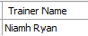
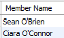

# Pattern Matching

Sometimes we do not always have the exact search criteria we need. Maybe we need to find some fitness classes with Yoga in the description. If we enter:

~~~sql
SELECT classDescription AS Description 
FROM FitnessClass 
WHERE classDescription = 'Yoga';	
~~~

This will only return classes with the description equal to Yoga, so classes like **Yoga for Beginners** or **Evening Yoga** would not be returned. 

So we need to broaden our search criteria so that it includes the term Yoga and is preceded by and/or followed by other term(s). To do this we use *Pattern Matching* with the **LIKE** clause. To denote several characters, use **%**:

~~~sql
SELECT classDescription AS Description 
FROM FitnessClass 
WHERE classDescription LIKE '%Yoga%';
~~~

This statement returns description of classes, that include **Yoga** in the description.

The *LIKE* operator allows us to pattern match. The **%** is a wildcard which stands for zero or more letters or numbers.	

What will each of the following return? Try these queries to see the results:

~~~sql
SELECT classDescription AS Description 
FROM FitnessClass 
WHERE classDescription LIKE 'Yoga%';
~~~	

~~~sql
SELECT classDescription AS Description 
FROM FitnessClass 
WHERE classDescription LIKE '%Yoga';';
~~~
	
The underscore is also a wildcard but it stands in for just one letter or number, try out the following:

~~~sql
SELECT * 
FROM GymMember 
WHERE county LIKE '_aterford';
~~~

## Exercises

1. Retrieve the first name and last name of all Trainers whose specialty includes the term Yoga. Concatenate first name and last name together and output the value as Trainer Name.

 

  
2. Retrieve the names (first and last) of all members whose last name start with O. Concatenate first name and last name together and output the value as Member Name.

 

