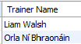

# BETWEEN ... AND

We can use the *BETWEEN ... AND* operators to search within an *inclusive range of values*, for example:

For Example, to return Classes that run from 30 - 50 mins:

~~~sql
SELECT * 
FROM FitnessClass 
WHERE duration BETWEEN 30 AND 50;
~~~

## NOT BETWEEN ... AND

To return Classes that run outside the range of the previous example:

~~~sql
SELECT * 
FROM FitnessClass 
WHERE duration NOT BETWEEN 30 AND 50;
~~~

## Exercise

1. Retrieve the names (first and last) of all trainers who earn 25000 - 35000. Output the returned records as follows:

 