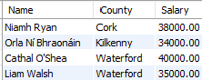

# ORDER BY

To sort your query results you should use the *ORDER BY* clause. This clause always comes last in your SELECT statement. *Ascending* order is the default.

Return the make, model and description of all pieces of equipment in alphabetical order by make:

~~~sql
SELECT make As Make, model AS Model, equipdescription AS Description 
FROM Equipment 
ORDER BY make;
~~~

To reverse the order you must specify *descending* order using the keyword *DESC*:

~~~sql
SELECT make As Make, model AS Model, equipdescription AS Description 
FROM Equipment 
ORDER BY make DESC;
~~~

You can also sort by more than one column, where the first column is the outer sorted value.

Return the make, model and description of all pieces of equipment in alphabetical order by make and within make by model:

~~~sql
SELECT make As Make, model AS Model, equipdescription AS Description 
FROM Equipment 
ORDER BY make, model;
~~~

## Exercises:

1. Retrieve the names of all members. Sort the name in alphabetical order (firstName within lastName). Again, output as follows:

2. Retrieve the names, towns, and county of all members. Sort and output the returned records as follows:

3. Retrieve the names, county, and salary of all trainer. Sort and output the returned records as follows:

