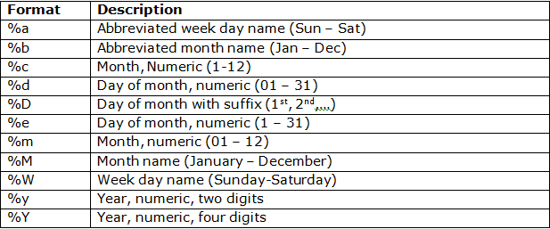

# Returning the Current Date

The following statement will display the current date.

~~~sql
SELECT CURDATE() AS "Today's Date";
~~~

The following statement will display the current date and time.

~~~sql
SELECT NOW() AS "Today's Date and Time";
~~~

If you wish to format the date and display it in a more readable manner, you can use DATE_FORMAT as follows:

~~~sql
SELECT DATE_FORMAT(CURDATE(), "%d %b %y")
AS "Today's Date";
~~~

DATE_FORMAT has 2 parameters:

 1. **date**: The date to be formatted, it is a required value.
 2. **format**: The format to use, it is also a required value. The format can be one or a combination of the following values:

You can include punctuation marks (e.g. commas, dashes, etc.) in the format string as follows:

~~~sql
SELECT DATE_FORMAT(CURDATE(), "%d-%b-%y")
AS "Today's Date";
~~~

## Exercises

- Output '2025-12-25' as follows:

