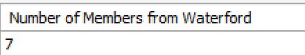
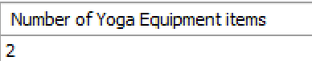
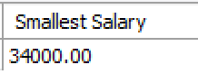
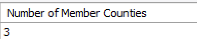

# Aggregate Functions Exercises

1. Return the number of members from Waterford. Label the returned value appropriately.

   
   
2. Return the number of equipment items that contain the term Yoga in the description. Label the returned value appropriately.

   
   
3. Return the minimum Trainer salary. Label the returned value appropriately.

   
   
4. Return the number of different counties that members come from. 

   