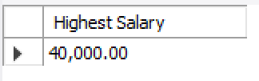

# Rounding and Formatting

## Using ROUND()

To round a numeric value to a whole number (or to 2 decimal places for example), use *ROUND*.

## Examples

Round 34.6792 to a whole number (35).

~~~sql
SELECT ROUND(34.6792);
~~~

Round 34.6792 to 2 decimal places (34.68).

~~~sql
SELECT ROUND(34.6792,2);
~~~

Round the average salary of trainers to two decimal places:

~~~sql
SELECT ROUND( AVG(salary), 2) AS 'Average Salary' 
FROM Trainer;
~~~

## Using FORMAT()

FORMAT() will format numbers to a specified number of decimal places, and will also add commas as thousands separators. 

~~~sql
SELECT FORMAT( AVG(salary), 2 ) AS 'Average Salary' 
FROM Trainer;
~~~

## Exercise

1. Return the highest salary rounded to 2 decimal places. Label the returned value appropriately.

   