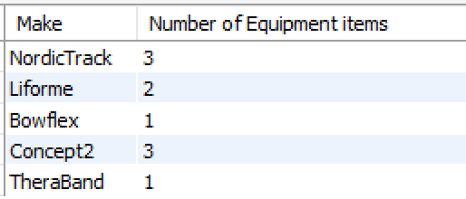
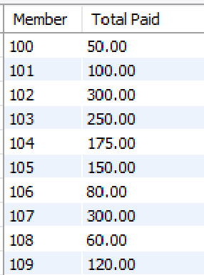

# GROUP BY

The *GROUP BY* clause can be used in the SELECT statement with aggregate functions. The *GROUP BY* clause groups records into summary rows (based on a column(s) value) and returns one value for each group. 

## Example

The following example returns the number of Gym member grouped by (per) county.

~~~sql
SELECT county, COUNT(memberId) AS "Number of Members"
FROM Gymmember 
GROUP BY county;
~~~

This will return one computed value for each different value of county.  In the select statement, the attribute used in the GROUP BY clause must be one of the attributes returned.

## Exercises

1.  Return the number of pieces of equipment for each Make. Label the returned value appropriately.

   
     
2.  Return the sum of payments made by each member from the Payment table. Label the returned value appropriately.

   