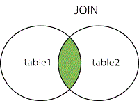

# Join

All the queries up until this point have been useful except for one major limitation - that is, we have been selecting from only one table at a time with the *SELECT* statement. It is time to introduce one of the most beneficial features of SQL and relational database systems - the **Join**. To put it simply, the **Join** makes relational database systems "relational".

*Joins* allow you to link data from two or more tables together into a single query result - from one single SELECT statement. 

A database is defined as a set of related data stored in tables of rows and columns. Most often the data we are looking for will be in more than one table. 

The **JOIN** keyword selects all rows from both tables if there is a match between the **join** columns in both tables (i.e. Primary Key - Foreign Key link).

~~~sql
SELECT column_name(s)
FROM table1
JOIN table2
ON table1.column_name=table2.column_name;
~~~

