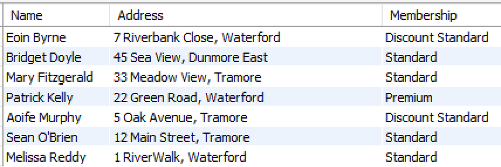

# Example One

We want to return the name, address (street and town), and membership of all members from **Waterford**.

There are four things to do here:

1. Identify which tables have the data you are looking for, in this case it is *Membershiptype* and *Gymmember*. These need to be joined.
2. Identify which columns are the primary and foreign keys in these tables; in this case it is *membertype* in the *Membershiptype* and *membertype* in the *Gymmember* table. We use these in the *ON* clause.
3. Identify which columns we want the query to output; in this case it is *firstName*, *lastName*, *street*, and *town* from the *Gymmember* table; and *membership* from the *Membershiptype* table. We will use these in our *SELECT*.
4. Add any conditions necessary, in this example: *county = "Waterford";

~~~sql
SELECT CONCAT(firstName, " ", lastName) AS Name, 
       CONCAT(street, ", ", town) AS Address, 
	   membership As Membership
FROM Gymmember JOIN Membershiptype
ON Gymmember.memberType = Membershiptype.membertype
WHERE county = "Waterford"
ORDER BY lastname, firstname;
~~~

OR

~~~sql
SELECT CONCAT(firstName, " ", lastName) AS Name, 
       CONCAT(street, ", ", town) AS Address, 
	   membership As Membership
FROM Gymmember JOIN Membershiptype USING (memberType)
WHERE county = "Waterford"
ORDER BY lastname, firstname;
~~~

