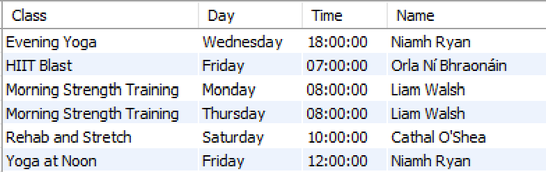
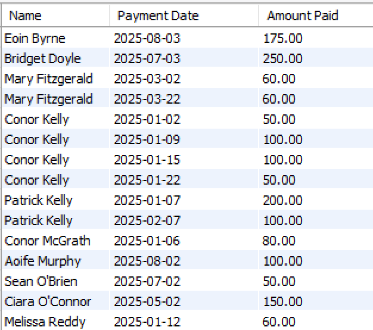
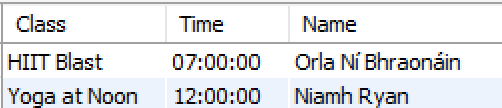

# Join Exercises

1.	Retrieve the description, day, time, and trainer by name for all fitness classes.  
        Sort the results in alphabetical order of description.

    
  
2.	List the member name (combined fname and lname), payment date and payment amount for all payments. 
        Sort in alphabetical order of LastName, firstName.

    
  
3. Retrieve the description, time, and trainer name for all fitness classes that take place on *Friday*.  
        Sort the results in alphabetical order of description.
		
    
   
