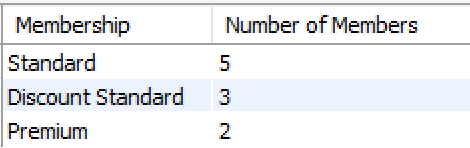

# Example Two

In this example, we wish to return the number of members per Membership and output the count (result) with the label *Number of Members*.

There are three things to do here:

1. Identify which tables have the data you are looking for, in this case its *Membershiptype* and *Gymmember*. These need to be joined.
2. Identify which columns are the primary and foreign keys in these tables; in this case it is *memberType* in the *Membershiptype* and *memberType* in the *Gymmember* table. We use these in the *ON* clause.
3. Identify which columns we want the query to output; in this case it is *membership* from the *Membershiptype* table and *count(memberId)* from the *Gymmember* table. We will use these in our *SELECT*.

Let's put it all together:

~~~sql
SELECT membership AS Membership, COUNT(memberid) AS "Number of Members"
FROM Gymmember JOIN Membershiptype
ON Gymmember.memberType = Membershiptype.membertype
GROUP BY membership
ORDER BY membership;
~~~

OR

~~~sql
SELECT membership AS Membership, COUNT(memberid) AS "Number of Members"
FROM Gymmember JOIN Membershiptype USING (memberType)
GROUP BY membership
ORDER BY membership;
~~~

