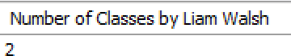

# More Join Exercises

1.	Return the number of classes by each Trainer (identified by name). Output the count with the label Number of Classes and identify each Trainer by name (combined firstName and lastName). Note: Use the combined firstName and lastName in the Group By clause (i.e. **GROUP BY lastname, firstname**). Sort in alphabetical order by Last Name and then First Name.
        
    
	
2. Return the number of classes given by Trainer (Liam Walsh). 

    
	
3.	Return the number of payments per member (identified by name). Output the count with the label Number of Payments and identify each member by name (combined firstName and lastName). Note: Use both lastName and firstName in the Group By clause. Sort in alphabetical order by Last Name and then First Name.
        
    

