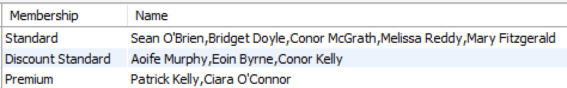

# GROUP_CONCAT()

If you execute the following command:

~~~sql
SELECT  membership As Membership, CONCAT(firstName, " ", lastName) AS Name
FROM Gymmember JOIN Membershiptype
ON Gymmember.memberType = Membershiptype.membertype
ORDER BY membership;
~~~

It will return the membership, plus the gym member belonging to that membership. If there are 2 or more members for a particular membership then there will be one record per member.

If you just want to return one record per membership, and if there are 2 or more members then they will be returned with the membership. The member list is separated by commas.

For this, we use the **GROUP_CONCAT()** function. The GROUP_CONCAT() function is used to concatenate data from multiple rows into one field. This is an aggregate (GROUP BY) function that returns a String value if the group contains at least one non-NULL value. Otherwise, it returns NULL.

~~~sql
SELECT  membership AS Membership, 
        GROUP_CONCAT(CONCAT(firstName, " ", lastName)) AS Name
FROM Gymmember JOIN Membershiptype
ON Gymmember.memberType = Membershiptype.membertype
GROUP BY membership
ORDER BY membership;
~~~

or

~~~sql
SELECT  membership AS Membership, 
        GROUP_CONCAT(CONCAT(firstName, " ", lastName)) AS Name
FROM Gymmember JOIN Membershiptype USING (memberType)
GROUP BY membership
ORDER BY membership;
~~~

