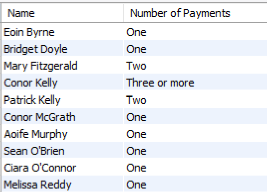
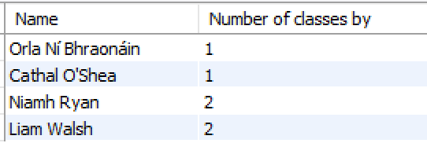
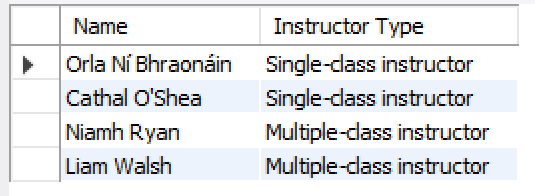

# CASE 

The **CASE** statement goes through conditions and returns a value when the first condition is met (like an IF-THEN-ELSE statement). So, once a condition is true, it will stop reading and return the result.

If no conditions are true, it will return the value in the ELSE clause.

If there is no ELSE part and no conditions are true, it returns NULL.

In the following example, we return each member by name and the money (balance) due. Instead of returning the balance value (1, 2, 3, etc...) some text is returned instead. 

~~~sql
SELECT CONCAT(firstName, ' ', lastName) AS Name,
CASE 
  WHEN balance = 0 THEN 'Owes no money'
  WHEN balance > 0 AND balance < 100 THEN 'Owes less than 100'
  WHEN balance >= 100 AND balance < 200 THEN 'Owes less than 200'
  ELSE 'Owes 200 or more'
END AS "Money Owing"
FROM Gymmember
ORDER BY lastName, firstName;
~~~

In the following example, again we return each member by name and the number of payments they have made. Again, instead of returning the actual number of loans (1, 2, 3, etc...) some text is returned instead. When the payment count is 1 , One is returned;  payment count is 2, Two is returned, otherwise Three or more is returned.

~~~sql
SELECT CONCAT(firstName, ' ', lastName) AS Name, 
CASE 
  WHEN COUNT(paymentId) = 1 THEN 'One'
  WHEN COUNT(paymentId) = 2 THEN 'Two'
  ELSE 'Three or more'
END AS 'Number of Payments'
FROM Gymmember JOIN Payment USING (memberId)
GROUP BY lastName, firstName
ORDER BY lastName, firstName;
~~~

## Exercise

Recall this exercise from a previous step:

- Return the number of classes by each Trainer (identified by name). Output the count with the label Number of Classes and identify each Trainer by name (combined firstName and lastName). Note: Use the combined firstName and lastName in the Group By clause. Sort in alphabetical order by Last Name and then First Name.
        
    
    
- Use the CASE operator to output an instructor type. It should read "Single-class instructor" for instructors with 1 class, "Multiple-class instructor" for those with multiple classes, and "Not an instructor" if they have no classes.
        
    