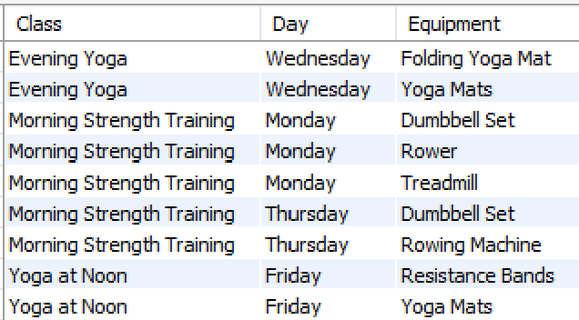
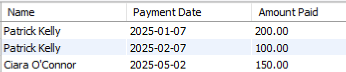
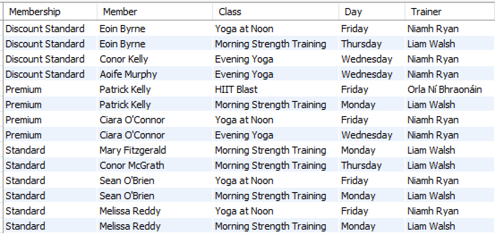

# Multi-table Join Exercises

1.	List the classes (description and day) and the corresponding equipment used. Label the columns as in the screenshot. Sort in alphabetical order by classDescription, then classDay, then equipDescription.

    
  
2.	List the members (name) and the payments they have made (date and amount) for all Premium members. Label the columns as in the screenshot. Sort in alphabetical order by member name (lastname and firstname).

    

3. For each type of membership, list the members (name), the classes they take (description and day), and the Trainer (name) who takes the class. Label the columns as in the screenshot. Sort in alphabetical order by membership, then member name (lastname and firstname).

    