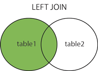

# Left Outer Join

The **LEFT JOIN** keyword returns all rows from the left (first) table (table1), with the matching rows in the right table (table2). The result is NULL in the right side when there is no match.

Syntax:

~~~sql
SELECT column_name(s)
FROM table1
LEFT JOIN table2
ON table1.column_name=table2.column_name;
~~~

Here is the previous example written with the *LEFT OUTER JOIN* syntax:

~~~sql
SELECT CONCAT(firstname, " ", lastName) AS Member, classId AS Class
FROM gymmember LEFT JOIN memberclass
ON gymmember.memberId = memberclass.memberId
ORDER BY lastName, firstName;
~~~

OR

~~~sql
SELECT CONCAT(firstname, " ", lastName) AS Member, classId AS Class
FROM gymmember LEFT JOIN memberclass USING (memberId)
ORDER BY lastName, firstName;
~~~

Execute the statement. Do you see all the null values?

**Notes:** 

- The LEFT JOIN keyword returns all the rows from the left table (gymmember), even if there are no matches in the right table (memberclass).
- A gymmember name will appear more than once if he/she has taken more than one class.

