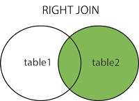

# Right Outer Join

The **RIGHT JOIN** keyword returns all rows from the right (second) table (table2), with the matching rows in the left table (table1). The result is NULL in the left side when there is no match.

Syntax:

~~~sql
SELECT column_name(s)
FROM table1
RIGHT JOIN table2
ON table1.column_name=table2.column_name;
~~~

 
Here is the previous example written with the *RIGHT OUTER JOIN* syntax:

~~~sql
SELECT CONCAT(firstname, " ", lastName) AS Member, classId AS Class
FROM  memberclass RIGHT JOIN gymmember
ON memberclass.memberId = gymmember.memberId
ORDER BY lastName, firstName;
~~~

OR

~~~sql
SELECT CONCAT(firstname, " ", lastName) AS Member, classId AS Class
FROM  memberclass RIGHT JOIN gymmember USING (memberId)
ORDER BY lastName, firstName;
~~~

**Note:**

- The RIGHT JOIN keyword returns all the rows from the right table (gymmember), even if there are no matches in the left table (memberclass).

