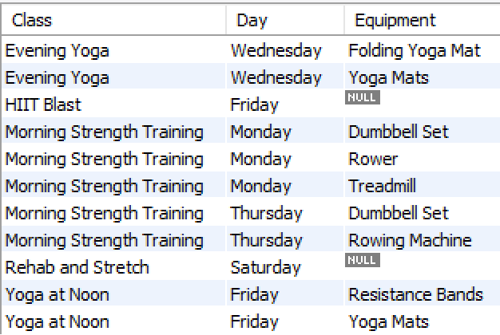
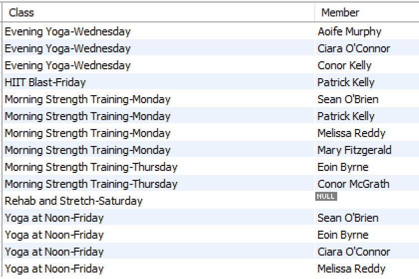
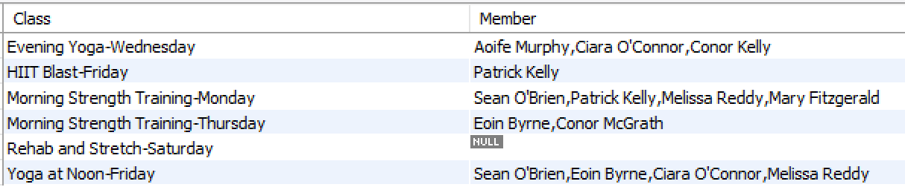

# Outer Join Exercises

1. Return the classes (description and day) and the corresponding equipment used (if any). Label the columns as in the screenshot. Sort in alphabetical order by classDescription, then classDay, then equipDescription.

      

2. Return the classes (description and day) of all classes taken by members (if any). Label the columns as in the screenshot. Sort in alphabetical order by classDescription, classDay.

     
 
3. Now, do the same query again but use GROUP_CONCAT() to combine the members into a single list for each class.
 
     
