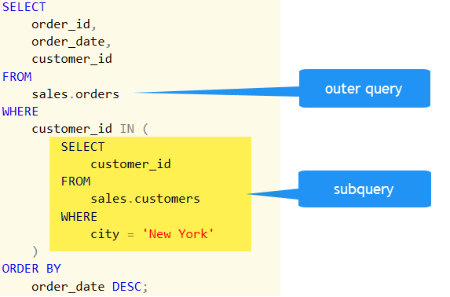

# About subqueries

A **subquery** is where we have a complete SELECT statement embedded within another SELECT statement. The results of this *inner* SELECT statement (or *subselect*) are used in the *outer* statement to help determine the contents of the final result.

A *subquery* can be used in the WHERE and HAVING clauses of an outer SELECT statement.

