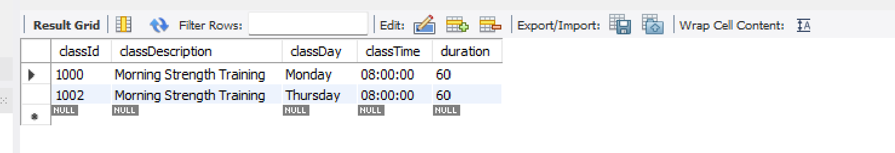

# Subquery with equality

In this lab, we will carry out subqueries on the Gym database.

Run this command to use the gym database:

~~~sql
use gym;
~~~

List the member IDs for the class with the description `Evening Yoga`.

```sql
SELECT memberId 
FROM memberclass 
WHERE classId = 
  (SELECT classId 
   FROM fitnessclass 
   WHERE classDescription ='Evening Yoga');
```

The inner SELECT statement finds the classId that corresponds to the fitness class with the description `Evening Yoga` (which is 1001). Having obtained this classId, the outer SELECT statement then retrieves the memberIds for the class. In other words, the inner SELECT returns a result table containing a single value `1001`. The outer SELECT becomes:

~~~sql
SELECT memberId 
FROM memberclass 
WHERE classId = 1001;
~~~

If we want to count the memberIds rather than display them, we could modify the above as follows:

```sql
SELECT count(memberId) as "Class enrollment"
FROM memberclass 
WHERE classId = 
  (SELECT classId 
   FROM fitnessclass 
   WHERE classDescription ='Evening Yoga');
```

## Exercise

- Using a subquery, return the list of classes run by Liam Walsh. These are the correct results:

