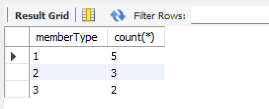
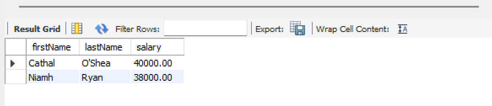

# Subqueries with aggregate functions

## Example One

The query `SELECT max(salary) FROM trainer` returns the salary of the highest-paid trainer. However, we may also want to know the name of the highest-paid trainer; we can use a subquery to achieve this. 

```sql
SELECT firstName, lastName, salary 
FROM trainer 
WHERE salary = 
  (SELECT max(salary) 
   FROM trainer);
```

The inner SELECT returns the maximum salary and then this value is used in the WHERE clause (WHERE salary = *n* ).


## Example Two

This query finds the details of the least popular membership type.

```sql
SELECT * 
FROM membershiptype
WHERE memberType = (
	SELECT memberType
	FROM gymmember
	GROUP BY memberType
	ORDER BY COUNT(*) ASC
	LIMIT 1
);
```

Explanation:

- The subquery selects the various memberTypes seen in the gym member table
- It groups them according to member type
- It then performs a COUNT of each type - here are the counts for each member type, as a point of reference:



As you can see, membership type 1 is the most popular, and 3 is the least popular.

- The subquery orders the types according to their count, in ascending order (from lowest to highest)
- And finally uses LIMIT to limit the result to just one value: membership type 3

Thus, the outer query becomes:

```sql
SELECT * 
FROM membershiptype
WHERE memberType = 3;
```

The result:


## Exercise

1. Using a subquery, return the first name, last name, and salary of all trainers who are paid a higher-than-average salary.

Expected result:




2. Using a subquery, find the name and location of the youngest gym member.

Expected result:

