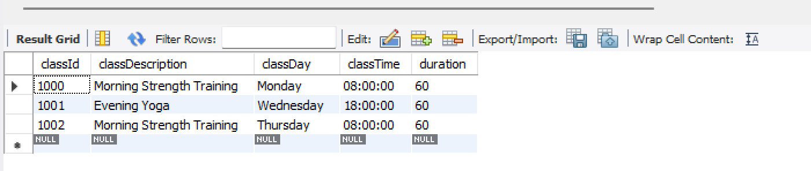
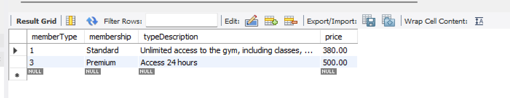

# Using ANY and ALL

The keywords ANY and ALL may be used with subqueries that produce a single column of numbers. 

## ALL
If the subquery is preceded by the keyword ALL, the condition will be true only if it is satisfied by all values produced by the subquery.

### Example One

List the details of fitness classes where the duration is greater than or equal to the longest class duration.  

```sql
SELECT classId, classDescription, classDay, classTime, duration 
FROM fitnessclass 
WHERE duration >= ALL(
	SELECT duration 
	FROM fitnessclass
);
```

The subquery returns a list of all class durations; the outer query returns results where the class is greater than or equal to every duration in the list. **Note:** whereas using MAX will find the duration of the longest class (60 mins), this approach will show all the classes of that length.




## ANY

If the subquery is preceded by the keyword ANY, the condition will be true if it is satisfied by any (one or more) values produced by the subquery. 

In this example, the subquery finds the prices of the different membership types. The outer query returns the details of any member that has a balance equivalent to (or greater than) the price of any membership type. 

```sql
SELECT *
FROM gymmember 
WHERE balance >= ANY(
	SELECT price 
    FROM membershiptype
);
```


## Exercise

Using a subquery, select all the membership types that have a price higher than the discounted student price. 

