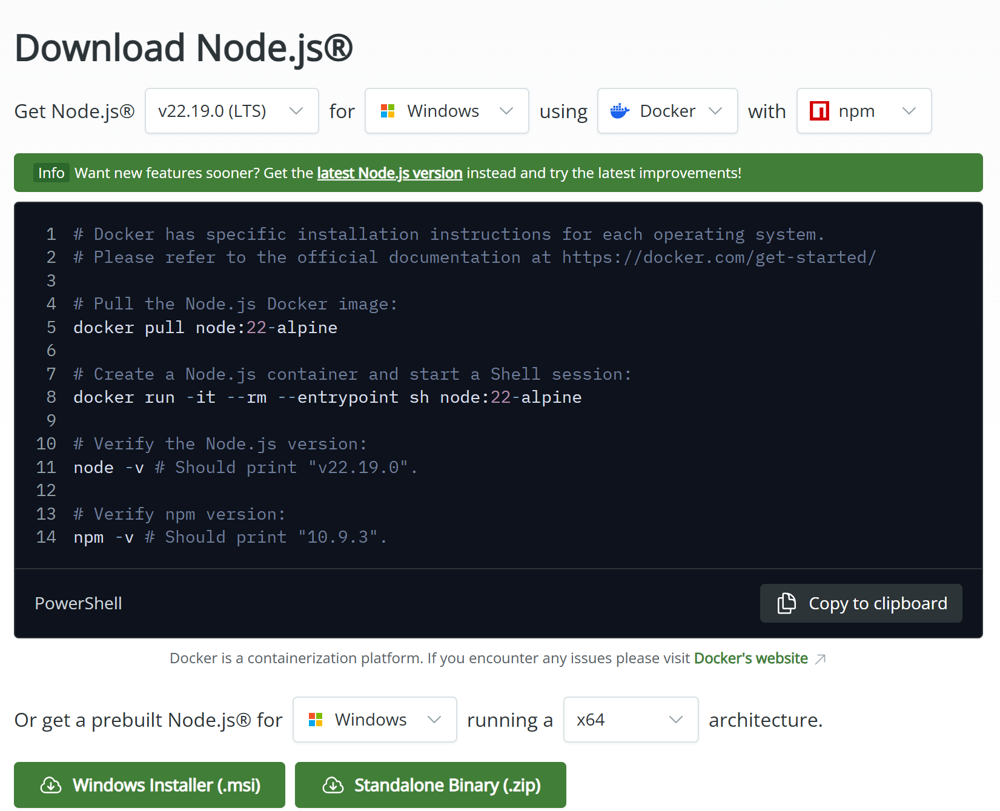
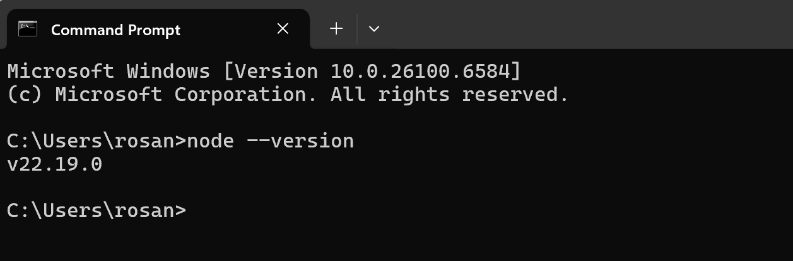

# 1. Install Node.js

Node.js is an open-source, cross-platform, back-end JavaScript runtime environment that and executes JavaScript code outside a web browser. Node.js lets developers use JavaScript to write command line tools and for server-side scripting. We will use Node.js as a local server to run our React apps.

- Go to the Node.js website:

[https://nodejs.org/en/](https://nodejs.org/en/)

- Download the version of Node.js appropriate for your operating system. Vite requires Node.js version 20.19+ or 22.12+.

This installation will include Node's package manager, "npm", which we will also use.

## Checking Node installation

To check if you already have Node installed, open a command prompt and type:

~~~
node --version
~~~

This will output a version number, as shown below.

