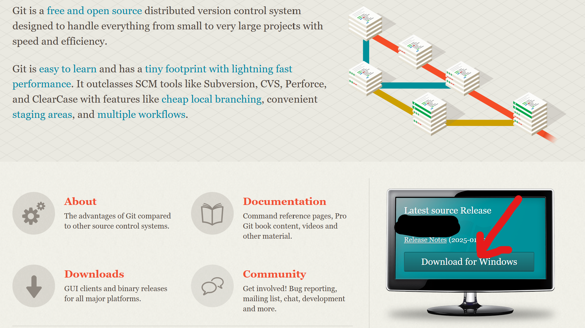

# 2. Set up Git

Git is a free and open source distributed version control system designed to handle everything from small to very large projects with speed and efficiency. We will use Git for version control while working on labs and assignments.

To work with Git on the command line, you will need to download and install Git:

[https://git-scm.com/](https://git-scm.com/)

Download the latest release for your operating system and follow the steps for installation.

## Checking Git installation

To verify your Git installation (or check the version you have installed), open a command prompt and type:

~~~
git --version
~~~
