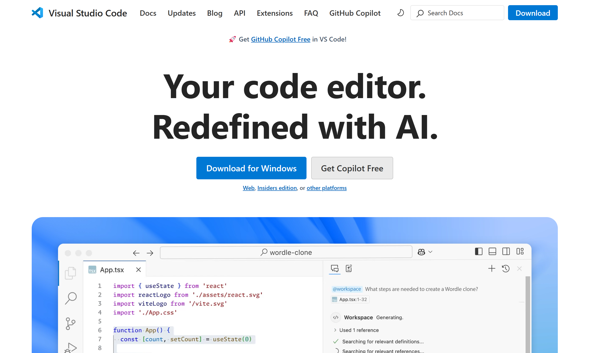

# 3. Development tools

The text editor and browser you use are up to you, but Visual Studio Code and Chrome are strongly recommended. You may already have these tools installed; if not, you can find them at the links in this section.

## Visual Studio Code

We will use Visual Studio Code to write our React applications. It is available here:

[https://code.visualstudio.com/](https://code.visualstudio.com/)

## Chrome

We will use Chrome DevTools for debugging our code. Chrome DevTools is a set of web developer tools built directly into the Google Chrome browser. 

You can download the Chrome browser here:
[https://www.google.com/intl/en_ie/chrome/](https://www.google.com/intl/en_ie/chrome/)

Also, the Chrome DevTools Guide is a useful reference if you want to learn more about the Chrome developer tools.
[https://developers.google.com/web/tools/chrome-devtools](https://developers.google.com/web/tools/chrome-devtools)

