# 4. Labs repository

In this step, we will create a new Git repository to store the labs for the first three weeks. 

## Remote GitHub repository 

- Go to GitHub.com and sign in.

[https://github.com/](https://github.com/)

- Click the "New" button for a new repository

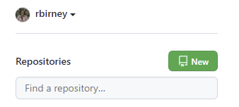

- Name the repository "react-basics-labs"

- Other settings:
    - Choose "Public" as the privacy setting
    - Tick to add a README file
    - Tick to add a .gitignore file (and choose Node as the template type)

- Click "Create repository"

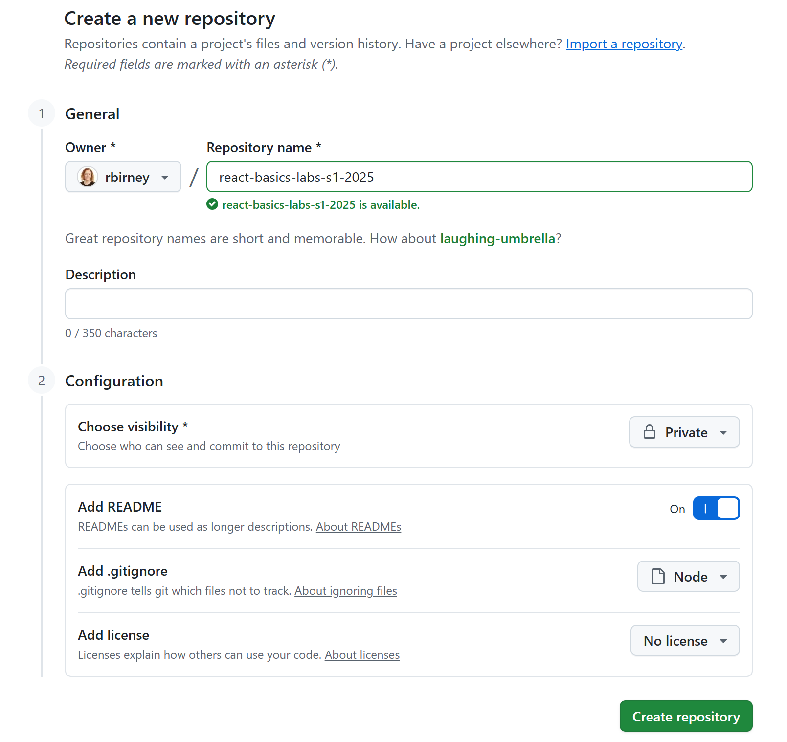

## Local repository

Next, we will create a local repository and connect it to the remote repository we just created on GitHub.com.

- On your computer, create a folder called "react-basics-labs".
- Open a command prompt in this location. A quick way to do this is to type "cmd" in the address bar and hit Enter.

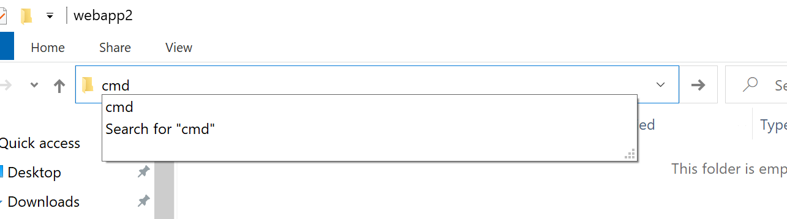

You should now be inside the react-basics-labs folder:

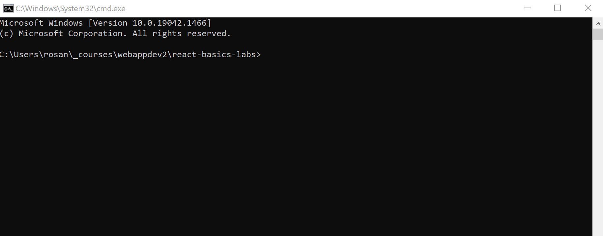

- Run the following commands:

~~~bash
git init
git branch -M main
~~~

- Get the link to your GitHub repository by clicking on the Code button on GitHub.com. Copy the link you find there.

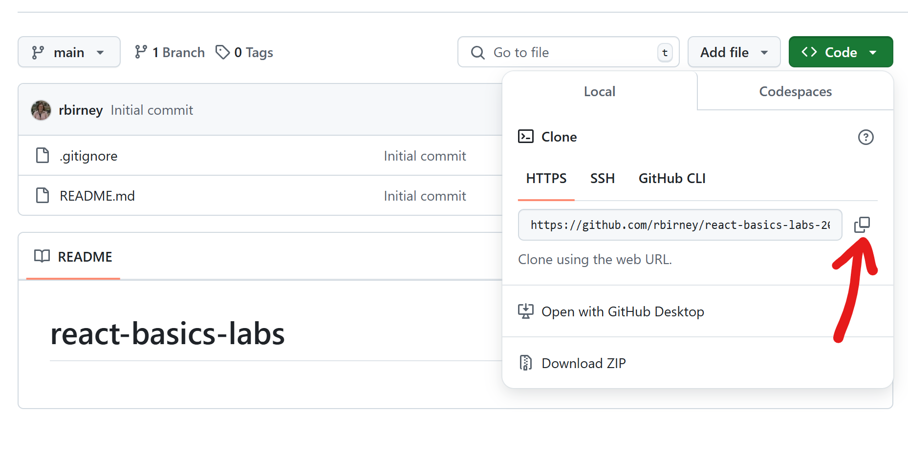

- **READ CAREFULLY**: Run this command, *replacing the link shown here with the link to your own repository*:

~~~bash
git remote add origin https://github.com/you/yourrepo.git
~~~

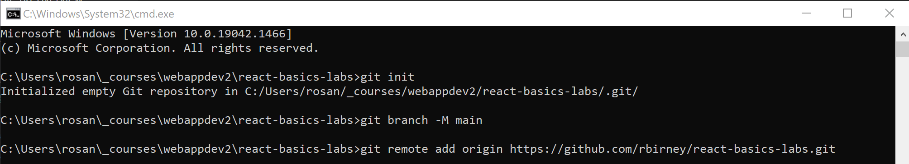

- Run the git pull command to fetch the readme and gitignore files from the remote repo:

~~~bash
git pull origin main
~~~

You should now see those files in your local folder:

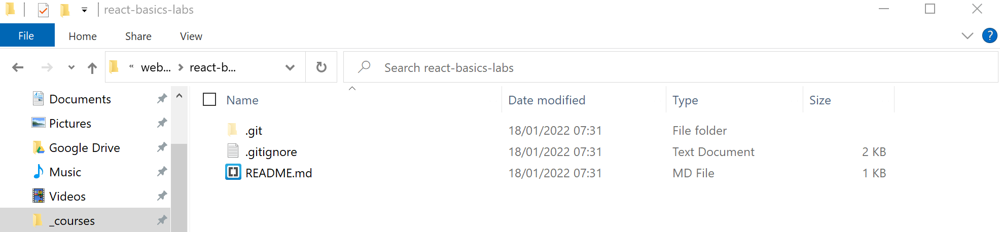

Note: if you do not see the .git folder, you may need to "show" hidden folders. In Windows, go the the File Explorer View menu, choose Show, and then select Hidden Items. On Mac, use CMD+SHIFT+DOT (.)

## Making and committing changes

Next, we will make some changes and commit them.

- Open the folder in Visual Studio Code (File -> Open Folder)
- Make some changes to the readme file (add some text - anything you want)

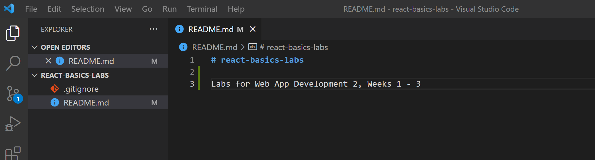

- Run the command `git status`. You can run this any time you want to check whether there are changes to commit.

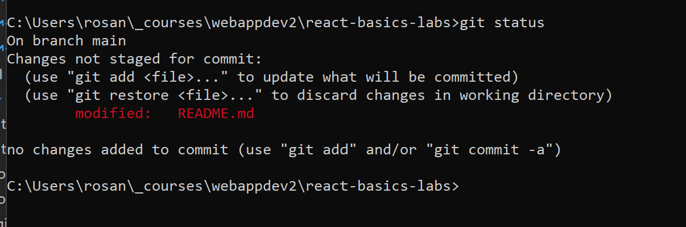

- Run this command to "stage" changes (this prepares the files to be committed)

~~~bash
git add -A
~~~

- Run this command to "commit" the files:

~~~bash
git commit -m "first commit"
~~~

This commits the files with the message "first commit". Committing files is like creating a checkpoint; the changes to files are still only stored locally at this point.

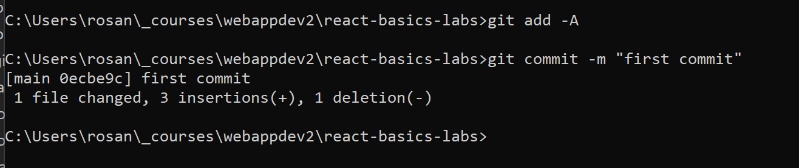

**NOTE:** If you are asked for configuration details when running your first commit, run the following commands (replacing the name and email with your own). You will only need to do this once; afterwards, retry your commit.

~~~bash
git config --global user.email 'youremail@anyemailwilldo.com'
git config --global user.name 'Your Name'
~~~

- Lastly, run this command to push the updates to the remote repository:

~~~bash
git push origin main
~~~

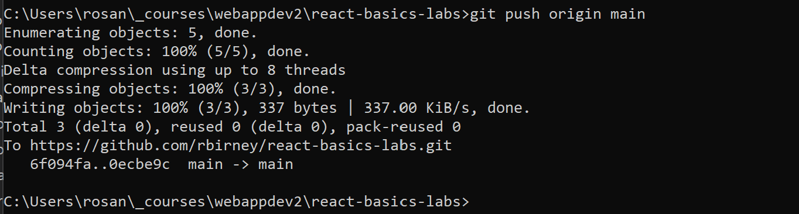

**NOTE:** you may be asked to sign in to GitHub if this is your first time using it on this computer. Follow the instructions in the prompt/error message in order to do this.

Depending on your operating system, you may need to generate a personal access token on GitHub.com for authentication. You can read more about that here:

<a href="https://docs.github.com/en/authentication/keeping-your-account-and-data-secure/about-authentication-to-github#https" target="_blank">
https://docs.github.com/en/authentication/keeping-your-account-and-data-secure/about-authentication-to-github#https</a>

You should now see your changes appear on GitHub.com:

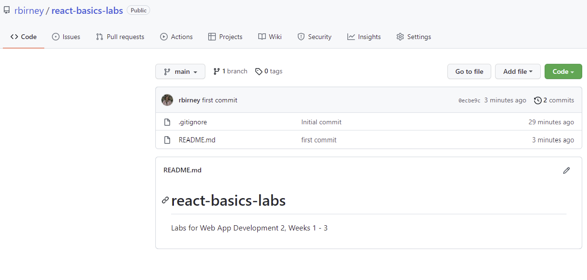