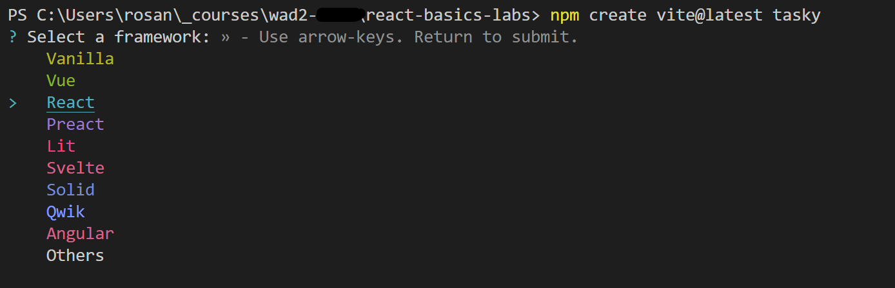
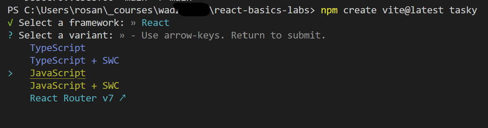
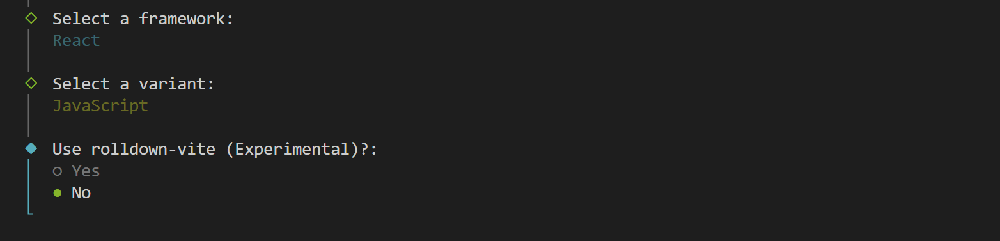
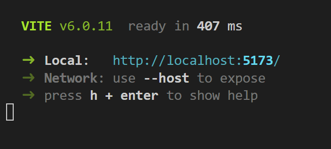

# 5. Create a React app

Now that we have all our tools set up, let's create our first React app.

We will use Vite to create our React app. Vite is a front-end build tool that quickly creates starter apps for a variety of frameworks (e.g. React, Vue, and many more).

You are not required to download any software to use Vite (we will access it using npm - Node Package Manager - from the command line) but you can read more about Vite here:

[https://vite.dev/](https://vite.dev/)

## Create a react app

- Open a command prompt and navigate to the folder where you stored your Git repository in the previous step.

- Enter the command `npm create vite@latest` followed by the name you wish to give the project (here, it is called "tasky"):

~~~bash
npm create vite@latest tasky
~~~

On Mac/Linux you may need to precede this with the "sudo" command:

~~~bash
sudo npm create vite@latest tasky
~~~

- Choose yes to install Vite.

- When prompted, choose **React** as the framework. 

- Choose **JavaScript** as the language.

- Leave "Use rolldown-vite" set to "No".

- Choose "Yes" to start the app straight away.

You should now see the following in your command prompt:

Open your browser and visit the localhost address your app is running on - you should see this page when the app is running successfully

### Starting and stopping the development server

Each time you work on your app you will need to navigate to its folder in the command prompt and start the app running.

- To move into the tasky folder:

~~~bash
cd tasky
~~~

- To start the app:

~~~bash
npm run dev
~~~

In order to view changes to the app while you're working on it, you should leave this process running.

Once you're finished, however, you can use `CTRL + C` to end the process. 