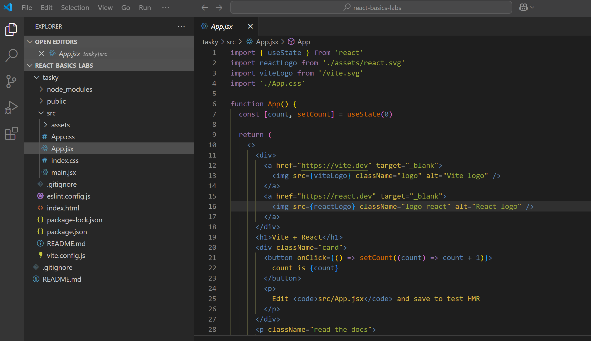

# Exercise

Open the tasky folder in Visual Studio Code (File -> Open Folder) and review the contents of the files within. Then proceed to the next lab, where we will start making changes to these files.

