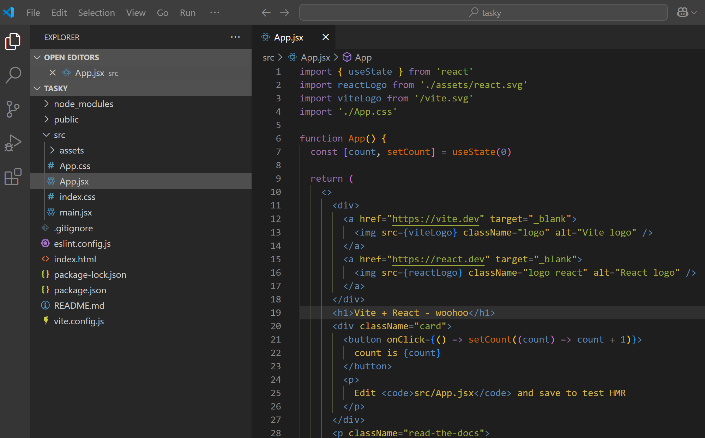
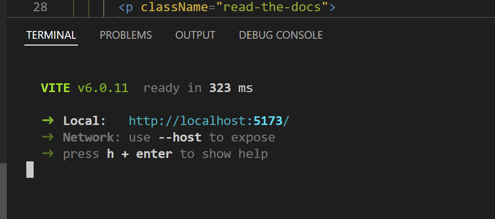
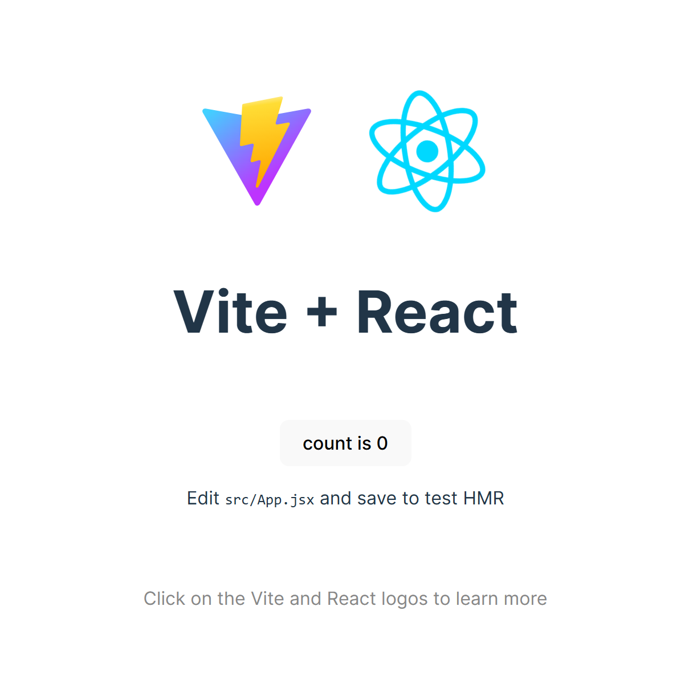

# 1. Set up

Note: you should have already completed the setup lab before beginning this lab. 

## Start the development server 

Open the "tasky" folder in Visual Studio Code (File -> Open Folder).

To start the development server, open an integrated terminal in Visual Studio Code (Terminal -> New Terminal).

Run the following command:

~~~bash
npm run dev
~~~

You should see the following in your terminal:

And your app will be running at the localhost address shown:

