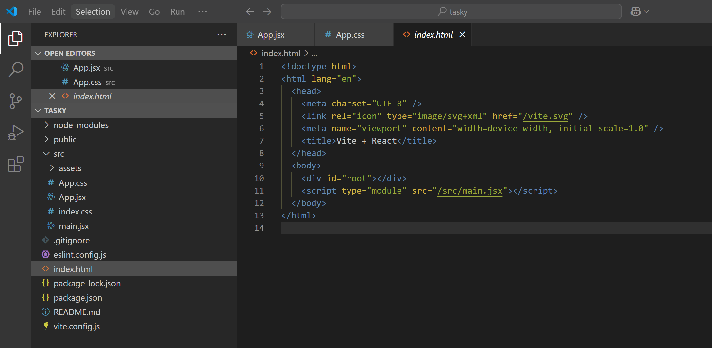
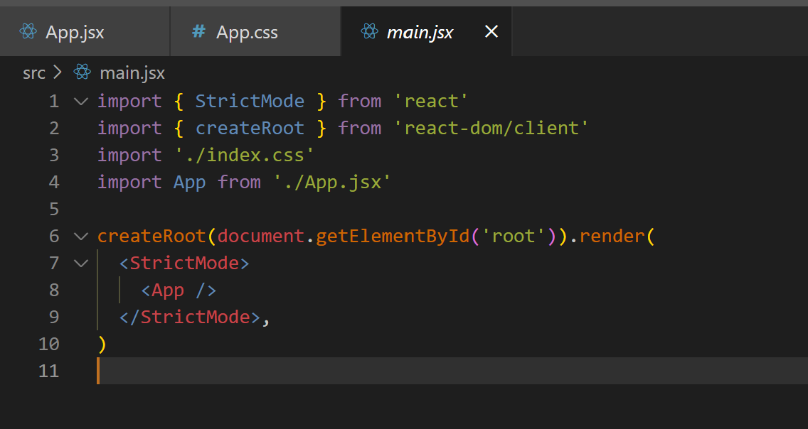

# 2. App.jsx

Currently, our React app has one component inside the `src` folder - App.jsx - with the following contents: 

~~~js
import { useState } from 'react'
import reactLogo from './assets/react.svg'
import viteLogo from '/vite.svg'
import './App.css'

function App() {
  const [count, setCount] = useState(0)

  return (
    <>
      

        
        
      

      <h1>Vite + React</h1>
      

        <button onClick={() => setCount((count) => count + 1)}>
          count is {count}
        </button>
        

          Edit <code>src/App.jsx</code> and save to test HMR
        

      

      

        Click on the Vite and React logos to learn more
      

    </>
  )
}

export default App
~~~

We will now replace the default contents with some code of our own.

- Replace the entire contents of the file with the following:

~~~js
import './App.css';

function App() {
  return (
    

      <h1>Tasky</h1>
    

  );
}

export default App;
~~~

As you make changes to your app, the page in the browser will update (as long as your development server is still running).

## index.html

In the public folder, there is a page called index.html. In the body section of the page, you will see a `
` element with the id "root". This is where all our React code will be rendered; we won't ever make changes to the index.html file itself. 

## main.jsx

The main.jsx file renders our React code to the index.html page. It imports our App component (line 4) and renders it to the root element on index.html (line 6).

