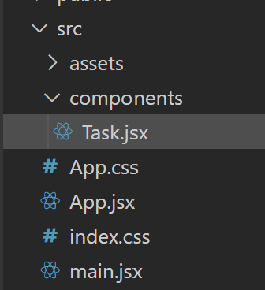
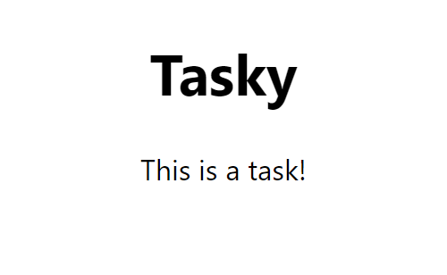

# 3. Task component

Next, we'll add our first component. 

## Creating a component

- Create a new folder in the 'src' folder called 'components'

- In this folder, create a new file called `Task.jsx`

- In the `Task.jsx` file, add the following code:

~~~js
const Task = () => {
    
    return (
        
This is a task!

    )
}

export default Task;
~~~

This imports the React library, creates the task component (using an arrow function), and exports the task component so that it can be used elsewhere.

This is an example of a *functional* component. It can also be written using regular function syntax (rather than an arrow function). That would look as follows:

~~~js
function Task(){
    
    return (
        
This is a task!

    )
}

export default Task;
~~~

## Using a component

Next, we will import our Task component into `App.jsx`. 

- Add this line after the css import:

~~~js
import Task from './components/Task';
~~~

Note the uppercase "T" in our naming of Task. It is good practice to name your components with an uppercase first letter; this helps to differentiate them from JSX elements that use all lowercase. 

- Add the Task component into the `
` element. Note that because there are no contents in the Task element, we use a self-closing tag here (`<Task />`).

~~~js
function App() {
  return (
    

      <h1>Tasky</h1>
      <Task />
    

  );
}
~~~

You should now see the Task component appearing in your browser:

