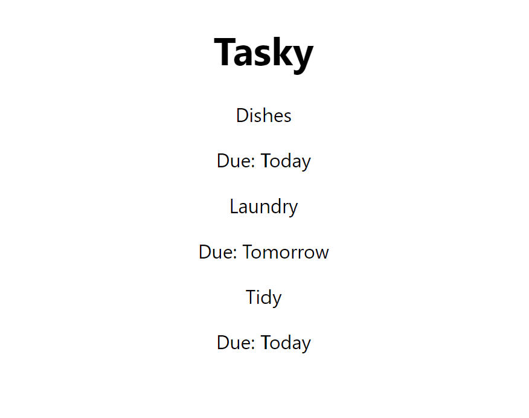

# 4. props

In the React language, "props" are properties that we can pass into our components. 

For example, if we add the attributes "title" and "deadline" to our Task component, as shown here:

~~~html
<Task title="Dishes" deadline="Today" />
~~~

We can then use these properties inside our component with the syntax:

~~~js
{props.title}
{props.deadline}
~~~

Below, we'll add some props to our Task component and then update the component to display those props.

## Add some properties

- In `App.jsx`, add properties to the `<Task />` element:

~~~html
<Task title="Dishes" deadline="Today" />
~~~

- Add two more Task elements with the following properties:

~~~html
<Task title="Laundry" deadline="Tomorrow" />
<Task title="Tidy" deadline="Today" />
~~~

The complete `App.jsx` file should now look like this:

~~~js
import './App.css';
import Task from './components/Task';

function App() {
  return (
    

      <h1>Tasky</h1>
      <Task title="Dishes" deadline="Today" />
      <Task title="Laundry" deadline="Tomorrow" />
      <Task title="Tidy" deadline="Today" />
    

  );
}

export default App;
~~~

## Using props

In the `Task.jsx` file, we can now make use of these properties.

 - First, we need to add the "props" parameter in the function defintion:

~~~js
const Task = (props) => {
    
    return (
        
This is a task!

    )
}
~~~

Once we have passed in the props, we use them with the syntax `{props.propertyname}`

- Update the task component to use the title and deadline props:

~~~js
const Task = (props) => {
    
    return (
        

            
{props.title}

            
Due: {props.deadline}

        

    )
}
~~~

**Important**: our components should always return one root element. For that reason, we will add a `
` element now to contain both our paragraph elements. Anything else we add later, we would also place within this `
` element. 

You should now see your three tasks appearing in the browser:

