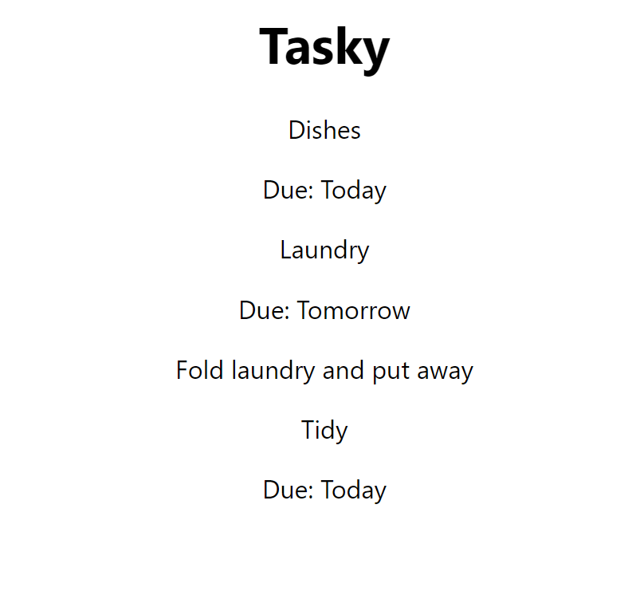

# 5. The children prop

The children prop is a special property that holds the contents of any of our component elements.

For example, if we add the following contents to one of our Task components:

~~~html
    <Task title="Laundry" deadline="Tomorrow">
        Fold laundry and put away
    </Task>
~~~

We can then use these contents in our components using the `{props.children}` syntax. The children prop can contain JSX and other React components as well as just text.

## Adding children

Update one of your tasks in `App.jsx` so that it has some contents:

~~~html
    <Task title="Laundry" deadline="Tomorrow">
        Fold laundry and put away
    </Task>
~~~

## Using the children prop

In `Task.jsx`, we will add another paragraph to output the contents of the children prop using the syntax `{props.children}`. 

~~~js
    return (
        

            
{props.title}

            
Due: {props.deadline}

            
{props.children}

        

    )
~~~

You should now see a second paragraph appearing under the Web App 2 Development task:

