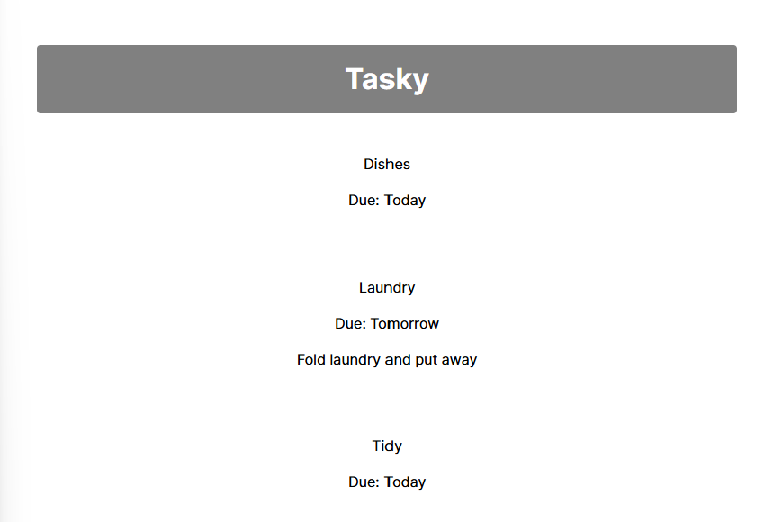
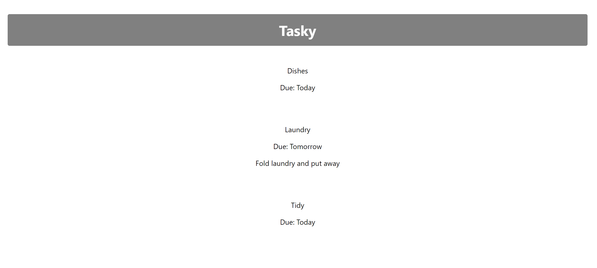
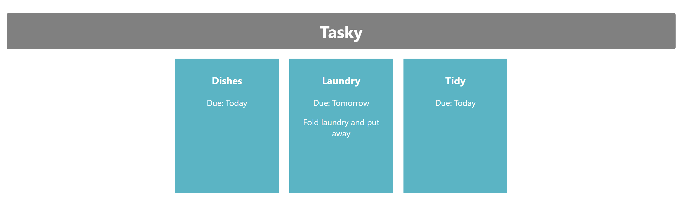

# 6. Adding some styles

There are currently some styles applied to our app; these can be seen in `App.css` and `index.css`. We're not using these styles anymore so we will delete them and apply our own.

- Remove the `index.css` file entirely.
- In the `main.jsx` file, remove the line at the top that imports `index.css`
- In `App.css`, replace the entire contents of the file with the following code:

~~~css
body {
  font-family: Inter, system-ui, Avenir, Helvetica, Arial, sans-serif;
  line-height: 1.5;
  font-weight: 400;
}

h1 {
  text-align: center;
  background-color: grey;
  color: white;
  padding: 14px 20px;
  margin: 8px 0;
  border: none;
  border-radius: 4px;
}

div {
  padding: 20px;
}
~~~

This will style the app header and add some padding around divs.

## Using classes

Next, we will apply some more styles using CSS classes. Using classes is a little different in React, as "class" is a reserved word that is already used elsewhere (when creating a class component). Instead, we use the keyword `className`.

- In `App.jsx`, replace the className "App" (line 6) with the name "container"

~~~html
    

~~~

- In `App.css` add the following CSS class:

~~~css
.container{
  text-align: center;
}
~~~

Everything should be centred on the page (as it was before):

## .card class

- Add the following CSS class called "card":

~~~css
.card {
  display: inline-block;
  vertical-align: top;
  font-family: system-ui;
  background: #5bb4c4;
  color: white;
  text-align: center;
  width: 180px;
  height: 240px;
  margin: 10px;
  padding: 10px;
  position: relative;
}
~~~

- Then, apply this class in the `Task.jsx` file:

~~~js
    return (
        

            
{props.title}

            
Due: {props.deadline}

            
{props.children}

        

    )
~~~

## .title class

- In App.css, add this CSS class called "title":

~~~css
.title {
  font-weight: bold;
  font-size: 1.2em; 
}
~~~

- And apply this class to the title paragraph in the `Task.jsx` file:

~~~js
    return (
        

            
{props.title}

            
Due: {props.deadline}

            
{props.children}

        

    )
~~~

Your page should now look like this:

