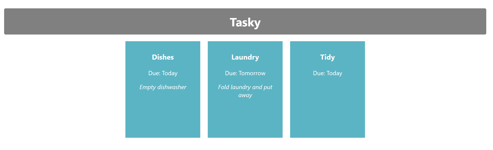

# Exercises

## Add to the app

1. Add a description property to some of the Tasks
2. Remove any children you have added (as the details of the task should now be stored in the description prop)
3. Use the description property in the Task component (where you previously used props.children)
3. Create a class to style the description (choose any styles you wish) and apply this to the description

When you're done, your page should look something like this:

## Commit and push changes

- Once you have completed this lab, open the "**react-basics-labs**" folder in a command prompt or integrated terminal.

- Run the following commands:

~~~bash
git add -A
git commit -m "Completed Tasky Lab 1"
git push origin main
~~~
